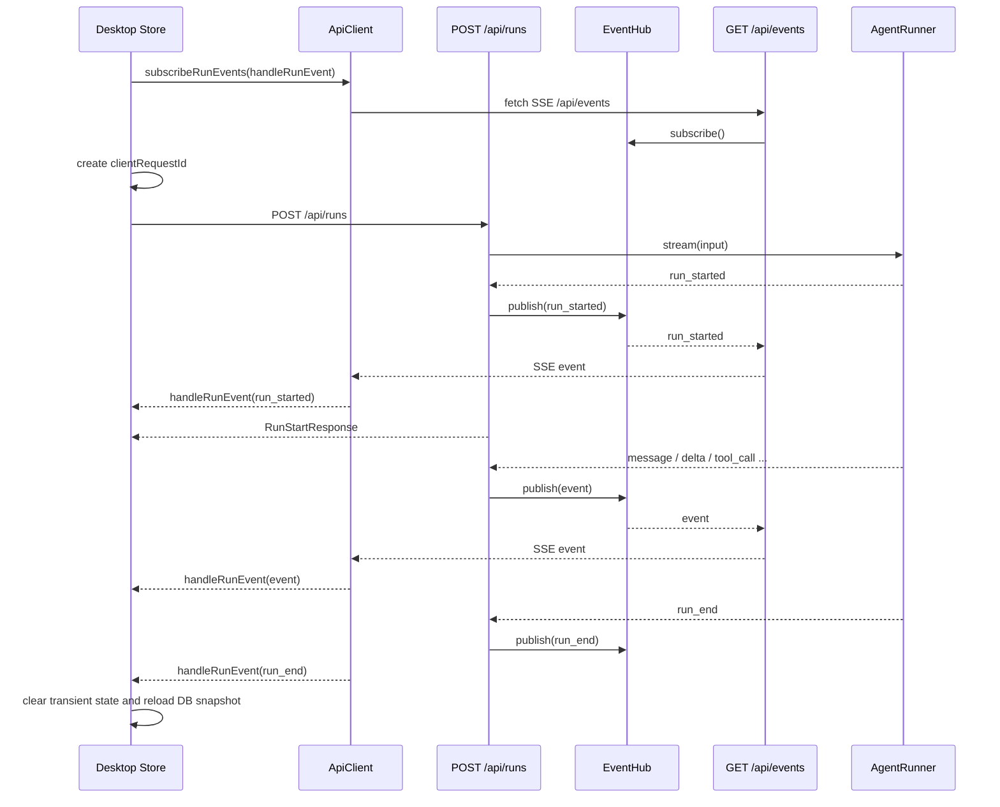

# 全局 SSE 事件流实现文档

本文记录桌面端运行事件从“每次 run 独占一条 SSE”迁移到“应用级全局 SSE + POST commands + DB 快照恢复”的实现。当前版本只覆盖桌面端主聊天和右侧小聊天；飞书、定时任务等进程内消费者仍直接消费 `AgentRunner.stream()`。

## 背景

`AskUserQuestion`、`ExitPlanMode` 和普通工具审批本质上已经是同一套后端机制：

1. 模型产生工具调用。
2. 后端持久化并发出 `tool_call(pending_approval)`。
3. `ApprovalQueue.wait()` 挂起当前 run。
4. 前端通过 `POST /api/approvals/:toolCallId` 提交审批、计划确认或 ask-user 回答。
5. 后端继续同一个 run，并把决议作为工具结果喂回模型。

因此这次迁移没有重写 `AskUserQuestion`、`ExitPlanMode` 或审批队列，而是调整桌面端接收运行事件的方式：run 的启动、审批、abort 都走普通 POST，运行事件统一从全局 SSE `/api/events` 推送。

## 目标与边界

目标：

- 应用启动后由桌面端维护一条全局运行事件 SSE。
- `POST /api/runs` 只负责启动 run，并在首个 `run_started` 出现后返回 run 元信息。
- 主聊天和右侧小聊天用 `clientRequestId/runId` 过滤各自事件，允许并发运行。
- SSE 断线期间不做事件 replay，重连后通过 DB 快照恢复可恢复状态。
- 保留旧 `POST /api/runs/stream`，避免影响测试、飞书、定时任务和其他进程内消费路径。

暂不做：

- 不引入 WebSocket。
- 不做持久化事件 replay。
- 不把飞书和定时任务迁到 `EventHub`。
- 不改变审批、ask-user、plan 的业务语义。

## Shared 契约

相关文件：

- `packages/shared/src/run.ts`
- `packages/shared/src/stream.ts`

新增字段与类型：

- `RunRequest.clientRequestId?: string`
- `StreamEvent.run_started.clientRequestId?: string`
- `runStartResponseSchema`
- `RunStartResponse`

`clientRequestId` 由客户端生成，用于在全局事件流中识别“这是谁启动的 run”。后端只回显，不赋予业务语义；真正的 run 生命周期仍以 `runId` 为准。

`RunStartResponse` 包含：

- `runId`
- `sessionId`
- `clientRequestId?`
- `providerId?`
- `model?`
- `reasoningMode?`

这保证 `POST /api/runs` 返回后，客户端即使还没收到全局 SSE 中的 `run_started`，也能把本地状态绑定到确定的 `runId/sessionId`。

## Backend 实现

相关文件：

- `apps/backend/src/events/event-hub.ts`
- `apps/backend/src/api/app.ts`
- `apps/backend/src/api/context.ts`
- `apps/backend/src/api/routes/runs.ts`
- `apps/backend/src/agent/agent-runner.ts`
- `apps/backend/src/agent/compaction.ts`

### EventHub

`EventHub<T>` 是进程内 live 事件总线：

- `subscribe(signal)`：创建订阅队列，返回 `AsyncIterable<T>`。
- `publish(event)`：向当前在线订阅者广播事件。
- 订阅断开或 abort 时清理队列。
- 只广播 live 事件，不落库、不回放。

每个订阅者内部使用 `AsyncEventQueue` 缓冲事件，避免生产者直接阻塞在 HTTP 写入上。新增、关闭订阅都会写中文日志，方便排查全局事件流连接数。

### GET /api/events

`GET /api/events` 返回 SSE：

- 鉴权继续沿用 `x-chengxiaobang-token`。
- 格式继续使用 shared 的 `encodeSseEvent()`。
- 15 秒发送一次 `: keep-alive` 注释心跳。
- 直接订阅 `context.eventHub.subscribe(request.signal)`。

桌面端没有使用原生 `EventSource`，因为它不能稳定携带自定义 token header；客户端使用 fetch 读取 SSE body。

### POST /api/runs

`POST /api/runs` 的核心行为由 `startRunAndPublish()` 完成：

1. 后台启动 `for await (const event of context.runner.stream(input))`。
2. 每个事件发布到 `EventHub`。
3. 首次看到 `run_started` 时解析出 `RunStartResponse` 并 resolve HTTP 请求。
4. 如果 `run_started` 前抛错，直接返回 HTTP error。
5. 如果 `run_started` 后后台抛错，则写 run 失败状态，并通过 `EventHub` 补发 `run_end(failed)`。

这里的关键点是：HTTP 请求只等待“run 已成功启动”，不等待 run 完成；真正的运行进度都经全局 SSE 到达。

### POST /api/runs/stream

旧入口保留：

- 仍然直接消费 `runner.stream(input)`。
- 仍然返回独占 SSE。
- 仍然有 15 秒心跳。
- 仍然在启动阶段失败时把错误转成失败事件流。

这保证老测试、内部 headless 消费路径和迁移外调用方不被一次性打断。

### AgentRunner

`AgentRunner.stream()` 的主逻辑保持原样，只在发 `run_started` 时附加 `clientRequestId`：

- 普通 run：`run_started.clientRequestId = input.clientRequestId`
- `/compact`：通过 `runCompaction()` 继续透传 `clientRequestId`

审批相关逻辑没有变化：

- mutating tool 在 `beforeToolCall` 中落 `pending_approval`。
- `ApprovalQueue.wait()` 继续阻塞当前 run。
- 拒绝审批仍作为工具错误结果返回模型，run 继续。
- `AskUserQuestion` 仍通过 approval decision 的 `answer` payload 恢复。
- `ExitPlanMode` 仍通过 approval decision 的 `editedSteps` 等 payload 恢复。

## Desktop API 实现

相关文件：

- `apps/desktop/src/renderer/lib/api.ts`

`ApiClient` 新增两个可选能力：

- `startRun(input): Promise<RunStartResponse>`
- `subscribeRunEvents(onEvent, options): () => void`

`subscribeRunEvents()` 内部维护：

- listener 集合。
- 单个 `AbortController`。
- 一条 fetch SSE 连接。
- 断线后的短退避重连。
- `onReconnect` 和 `onError` 回调。

当第一个 listener 注册时创建连接；最后一个 listener 退订时 abort 连接。事件到达后广播给当前所有 listener，主聊天和右侧小聊天各自过滤。

重连策略：

- 首次连接只记录日志。
- 后续重连成功后触发所有 listener 的 `onReconnect`。
- 连接异常时记录日志并触发 `onError`。
- 1 秒后继续重连，直到没有 listener 或被 abort。

## 主聊天 Store 实现

相关文件：

- `apps/desktop/src/renderer/store/index.ts`

新增 transient 状态：

- `activeRunClientRequestId`
- `activeRunModel`
- `activeRunLastAssistant`

新增核心 action：

- `handleRunEvent(event, options?)`
- `recoverActiveRunSnapshot()`

### runPrompt()

新的 `runPrompt()` 只负责启动 run：

1. 解析 provider/model/reasoningMode。
2. 清理上一轮运行态。
3. 生成 `clientRequestId = createId("client_run")`。
4. 写入 `isRunning` 和 `activeRunClientRequestId`。
5. 调用 `apiClient.startRun(runInput)`。
6. 用返回的 `runId/sessionId/model` 绑定当前运行。

如果当前 `ApiClient` 没有 `startRun/subscribeRunEvents`，仍回退旧 `streamRun()`，兼容测试和旧实现。

### handleRunEvent()

所有主聊天运行事件都经过 `handleRunEvent()`：

- `session_updated` 全局接收，只更新侧边栏会话元数据。
- `run_started` 只有匹配当前 `clientRequestId` 或 `activeRunId` 才处理。
- 其他 run 级事件只处理匹配当前 `activeRunId` 的事件。

事件处理规则：

- `delta(text)`：进入 renderer 本地合帧缓冲，约 32ms 批量追加到 `streamText`。
- `delta(thinking)`：进入 renderer 本地合帧缓冲，约 32ms 批量追加到 `thinking`，并记录 `thinkingStartedAt`。
- `tool_activity`：更新当前工具参数活动预览。
- `message`：追加持久化消息；assistant 消息会清空实时 text/thinking 缓冲，并记录 `activeRunLastAssistant`。
- `tool_call(pending_approval)`：进入 `pendingTool`，等待底部审批/ask-user/plan 卡片。
- `tool_call(running)`：进入 `runningTool` 并写入工具历史。
- `tool_call(completed|failed|rejected)`：清理 pending/running，并 upsert 到工具历史。
- `run_end`：清理运行态，写 usage/runMeta，然后触发 `refresh()` 和当前会话详情重拉。

`message`、`tool_call`、`run_end`、`setup_error` 这类非 delta 事件处理前会先强制 flush 本地 delta 缓冲，避免最终 assistant 消息清空实时文本后，旧的流式片段又被定时器回写。重复点击当前已选中的运行中会话会被视为 no-op，不会清空 `activeRunId`、`streamText` 或运行归属映射。

### DB 快照恢复

`recoverActiveRunSnapshot()` 只在当前 store 同时有 `activeSessionId` 和 `activeRunId` 时执行：

1. 拉取当前会话 messages。
2. 拉取当前会话 runs/toolCalls。
3. 找到当前 `activeRunId`。
4. 如果 run 不存在或状态不是 `running`，说明运行已经结束或不可恢复，清理运行态。
5. 如果 run 仍为 `running`，只从该 run 的 toolCalls 中恢复最新 `pending_approval` 或 `running` 工具。

这个限制很重要：没有当前 `activeRunId` 时不恢复历史 `status="running"` 残留，避免把旧脏数据误判成活跃 run。

## 右侧小聊天实现

相关文件：

- `apps/desktop/src/renderer/lib/side-chat.ts`
- `apps/desktop/src/renderer/components/right-panel/SideChatPanel.tsx`

右侧小聊天拥有自己的本地 reducer 状态：

- `sessionId`
- `clientRequestId`
- `runId`
- `items`
- `streamText`
- `pendingTool`
- `running`
- `error`

发送时：

1. 生成 `clientRequestId = createId("side_run")`。
2. reducer 进入 `send` 状态。
3. 调用 `client.startRun(runInput)`。
4. 根据 `RunStartResponse` 补齐 `runId/sessionId`。
5. 后续全局 SSE 事件由订阅回调按 `clientRequestId/runId` 过滤。

过滤规则：

- `run_started`：必须匹配当前 `clientRequestId`。
- 后续事件：必须匹配当前 `runId`。
- `session_updated`：侧边小聊天忽略。

组件里维护了 `stateRef`，并在事件进入 reducer 前同步更新，避免 `run_started` 与后续 `message/tool_call/run_end` 紧贴到达时，订阅回调读到旧 `runId` 而误过滤。

## 事件时序

主聊天启动一次 run 的典型时序：



## AskUserQuestion 与 plan 的实际走法

迁移后，ask-user 和 plan 的关键行为没有变：

- 模型请求 `AskUserQuestion` 或 `ExitPlanMode`。
- 后端发出 `tool_call(pending_approval)`。
- 主聊天 `handleRunEvent()` 设置 `pendingTool`。
- UI 根据 tool name 渲染对应卡片。
- 用户点击选项、输入自由文本或确认计划。
- 前端调用 `POST /api/approvals/:toolCallId`。
- 后端 `ApprovalQueue.wait()` 恢复。
- 同一个 run 继续把后续事件推到全局 SSE。

因此全局 SSE 只是把“事件接收通道”从 per-run 连接改成 app-level 连接，不改变用户决策如何回到模型循环。

## 错误处理与日志

关键日志点：

- `EventHub`：订阅新增、关闭。
- `/api/events`：事件流中断。
- `/api/runs`：启动失败、后台运行失败、失败状态写入失败。
- `ApiClient`：连接全局事件流、异常、关闭后重连。
- 主 store：全局事件流异常、DB 快照恢复开始/失败。
- 右侧小聊天：全局运行事件流异常。

启动前失败：

- `POST /api/runs` 在 `run_started` 前遇到错误时直接返回 HTTP error。
- 不会留下一个已经绑定到前端的 active run。

启动后失败：

- 后台消费 `runner.stream()` 时如果抛错，会尝试写 run failed，并发布 `run_end(failed)`。

断线：

- 断线期间丢失的 delta 不补发。
- 重连后触发 DB 快照恢复，只恢复消息、工具状态和运行态。

## 测试覆盖

新增或更新的关键测试：

- `packages/shared/test/contracts.test.ts`
  - `RunRequest.clientRequestId`
  - `run_started.clientRequestId`
- `packages/shared/test/sse.test.ts`
  - SSE round trip 覆盖 `clientRequestId`
- `apps/backend/test/event-hub.test.ts`
  - 多订阅者广播
  - 退订后不再收到事件
- `apps/backend/test/api-app.test.ts`
  - `POST /api/runs` 返回 `runId/sessionId`
  - `GET /api/events` 收到完整事件序列
  - 启动前失败返回 HTTP error
  - 旧 `/api/runs/stream` 仍保留回归覆盖
- `apps/desktop/test/composer.test.tsx`
  - 主聊天使用 `startRun + subscribeRunEvents`
  - 全局事件驱动 message/run_end
  - planMode 请求仍携带 `planMode: true`
  - ask-user 等待期仍可通过 composer 输入自定义回答
- `apps/desktop/test/side-chat.test.tsx`
  - 右侧小聊天使用 `startRun`
  - 按 `clientRequestId/runId` 过滤全局事件
  - 不污染主聊天状态

已执行验证：

```bash
pnpm test packages/shared/test/contracts.test.ts packages/shared/test/sse.test.ts apps/backend/test/event-hub.test.ts apps/backend/test/api-app.test.ts apps/desktop/test/composer.test.tsx apps/desktop/test/side-chat.test.tsx
pnpm test apps/backend/test/agent-runner.test.ts apps/backend/test/agent-loop.test.ts
pnpm typecheck
```

## 后续可演进方向

1. 更新 `docs/architecture.md`，把主运行入口从单一 `/api/runs/stream` 改成全局事件流架构。
2. 将飞书和定时任务按需接入 `EventHub`，让后台 run 也能被桌面端实时观察。
3. 如果需要跨后端重启恢复，可新增持久化 event log 和 `lastEventId` replay。
4. 为全局事件流增加更细的 listener 诊断，例如当前订阅者数量、最近一次事件时间、重连次数。
5. 把测试中的 React `act(...)` warning 单独清理，降低未来前端测试输出噪音。
